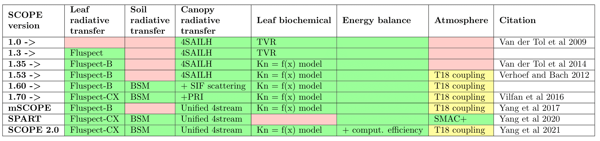

# SCOPE

Soil Canopy Observation, Photochemistry and Energy fluxes (SCOPE, Van der Tol et al., <a href="https://doi.org/10.5194/bg-6-3109-2009" target="_blank">2009</a>, Yang et al., <a href="https://doi.org/10.5194/gmd-14-4697-2021" target="_blank">2021</a>) radiative transfer and energy balance model.

The manual is available at ReadTheDocs https://scope-model.readthedocs.io/en/master/  (If you are offline just open **./docs/_build/html/index.html** in your browser.)

Video tutorials are available on 

<u>References</u>:

Yang, P., Prikaziuk, E., Verhoef, W., and Van der Tol, C. 2021
*"SCOPE 2.0: a model to simulate vegetated land surface fluxes and satellite signals"*
Geoscientific Model Development, 14, 4697–4712, https://doi.org/10.5194/gmd-14-4697-2021

Van der Tol, C., W. Verhoef, J Timmermans, A Verhoef, and Z Su. 2009. 
*“An Integrated Model of Soil-Canopy Spectral Radiances, Photosynthesis, Fluorescence, Temperature and Energy Balance.”*
Biogeosciences 6 (12): 3109–29, https://doi.org/10.5194/bg-6-3109-2009

