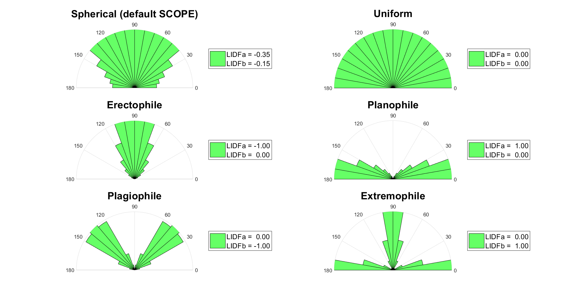

input
======

.. contents::


Input data files
--------------------

Main input files - ``filenames.csv, input_data.scv, setoptions.csv`` (former excel sheets) and optional ``mSCOPE.csv``

.. list-table::
    :widths: 30 70
    :header-rows: 1
    :stub-columns: 1

    * - file
      - content
    * - options
      - :ref:`options:Options`
    * - filenames
      - filenames for current simulation and for time-series
    * - inputdata
      - values for :ref:`structs/input/input_index:input structs`
    * - mSCOPE
      - leaf traits per canopy layer: *optional* only used when ``options.mSCOPE == 1``

To find out ranges and units of input parameters take a look into :ref:`structs/input/input_index:input structs`.

Pay extra attention to the :ref:`options:``simulation```


Directories
-------------

Directories which name starts with dataset provide timeseries input: ``options.simulation == 1``

dataset dat
""""""""""""""""""""""""""

Former style of timeseries run, when each parameter is provided in individual .dat file.

dataset for_verification
""""""""""""""""""""""""""

Newer style of timeseries run, when each parameter is provided in individual columns of single .csv file.

The file ``input_data_latin_hypercube_ts.csv`` was created with :func:`latin_hypercube_input`, which samples parameters within the borders specified in ``input_borders.csv``.

As the name suggests, this data is used to run SCOPE for the very first time (verification run).

dataset mSCOPE_ts
""""""""""""""""""""""""""

‘dataset mSCOPE_ts’ contains time series of meteorological (**meteo_ec_csv**) and vegetation (**vegetation_retrieved_csv**) data
and an example of mSCOPE input file for timeseries mode (**mSCOPE_csv**).
If option ``timeseries`` is on we expect the user to have similar files in **'./input/dataset X'**.


meteo_ec_csv
```````````````````

``ts_input.csv`` - a file with meteorological data (``Rin, Rli, p, Ta, u, ea``) and a timestamp ``f_date``.

The timestamp is in berkeley format of eddy covariance (FLUXNET standard since 2015) - YYYYMMDD[HHMM].

In our example file half-hourly data are provided. It is possible to work with any time interval, but due to the thermal inertia of the soil, the calculation of soil temperature may not be accurate when the time interval is longer than three hours.

As a sample of eddy covariance data in 'berkeley' format (FLUXNET standard since 2015) ``ec_berkeley.csv`` is given.
    * **cab** and **lai** columns where inserted to demonstrate how to avoid 'vegetation_retrieved_csv' (if you do not want our interpolation) but still provide changing vegetation parameters. The usage is demonstrated in ``input_data_ec_cab_lai.xlsx``.

vegetation_retrieved_csv
````````````````````````````
``interpolatable.csv`` has time series of vegetation parameters Vcmax and Cab.
The time step here **does not** have to coincide with the one in the 'meteo_ec_csv' (but has to fully contain the latter), because values from 'vegetation_retrieved_csv' are **interpolated** to the time step of the 'meteo_ec_csv'.

This file is *optional*.

This file can be made from the results of :ref:`retrieval:Retrieval (Model inversion)`: it is just enough to add a column with timestamp.

.. warning::
    * column name of the timestamp (**t** on **filenames** tab) in 'meteo_ec_csv' and 'vegetation_retrieved_csv' should be the same (TIMESTAMP_START, for example)
    * Excel truncates long integers (as timestamp) in .csv files => do not modify timeseries files with Excel or declare the column as text.
    * we can calculated date from DOY and year for you:
        - provide **t** as decimal (julian) day of year (as in SCOPE < v1.74)
        - provide year column in your .csv
        - startDOY, endDOY must **remain** in YYYYMMDD[HHMM] format

.. note::
    SCOPE uses date for 2 things only:
        * input/output:
            - subset your  'meteo_ec_csv' to startDOY, endDOY
            - write it into 'fluxes.dat', 'surftemp.dat', 'radiation.dat'
        * calculations:
            - solar zenith angle (tts) if it is not provided
                - if your timeseries are from different places (lat, lon) you **must** provide tts
            - to account for soil temperature from the previous step if ``options.soil_heat_method == 0``
                - if your timeseries are not ordered => set ``options.soil_heat_method == 2``

mSCOPE_csv
`````````````
``input_mSCOPE_timeseries.csv`` is also interpolatable. Columns - canopy layer parameters, rows - time.


directional
""""""""""""

The input in the directory ‘directional’ is only used for multi-angle simulations (if the option ‘directional’ is switched on in parameters. In this directory one can provide the observer’s zenith and azimuth angles. The files in this directory have two columns: the first column is the observer’s zenith angle, the second the observer’s azimuth (relative to that of the sun, counterclockwise), both in degrees. If the option ``directional`` is switched on, SCOPE will calculate the radiance spectrum in all directions given in the input file.


fluspect_parameters
""""""""""""""""""""

In this directory, absorption spectra of different leaf components are provided, according to PROSPECT 3.1, as well as Fluspect input: standard spectra for PSI and PSII.

leafangles
"""""""""""

In this folder, example leaf inclination distribution data are provided. It is possible to use these distributions instead of the leafinclination model of Verhoef (1998 :cite:`Verhoef1998`) with the two parameters LIDFa and LIDFb. In that case, provide a filename in the ``input_data.xlsx`` tab **filenames** or the file ``filenames.m``.

Possible leaf angle distributions (LADs) that can be created using LIDFa and LIDFb are presented in:




radiationdata
""""""""""""""

``RTMo.m`` calculates spectra based on MODTRAN5 outputs (T-18 system, :cite:`Verhoef2018`). One .atm (atmospheric) file is provided in the data, 12 more are provided separately in a different .zip folder (in order to minimize the size of the SCOPE package, these are not provided standard). Note that in the input data  (files as well as the spreadsheet), the broadband input radiation may be provided. SCOPE linearly scales the input spectra of the optical and the thermal domain in such a way, that the spectrally integrated input shortwave and long wave radiation matches with the measured values. A limitation of this approach is that the same shape of the input spectrum is used independent on the atmospheric conditions. If this scaling is not wanted, then leave ‘Rin’ and ‘Rli’ empty in the spreadsheet.

.. Note::
    In earlier versions of the model (1.34 and older), two input spectra of solar and sky radiation were provided (rad.txt and rad2.txt) in this directory. The data were calculated with MODTRAN4. The ASCII file in this directory consisted of three columns containing the following. The first column contained the wavelength in nm, the second column the solar radiation in W m-2 μm-1, and the third column the sky radiation in W m-2 μm-1. These data are now obsolete (since version 1.40).


soil_spectra
""""""""""""""
In this directory, the soil spectrum is provided. The ASCII file in this directory consists of two columns containing the following: The first column contains the wavelength in μm, the following columns reflectance spectra. Note that it is also possible to simulate a soil reflectance spectrum with the BSM model. In that case the values for the BSM model parameters are taken from the input data, and the archived spectra in this folder are not used.


