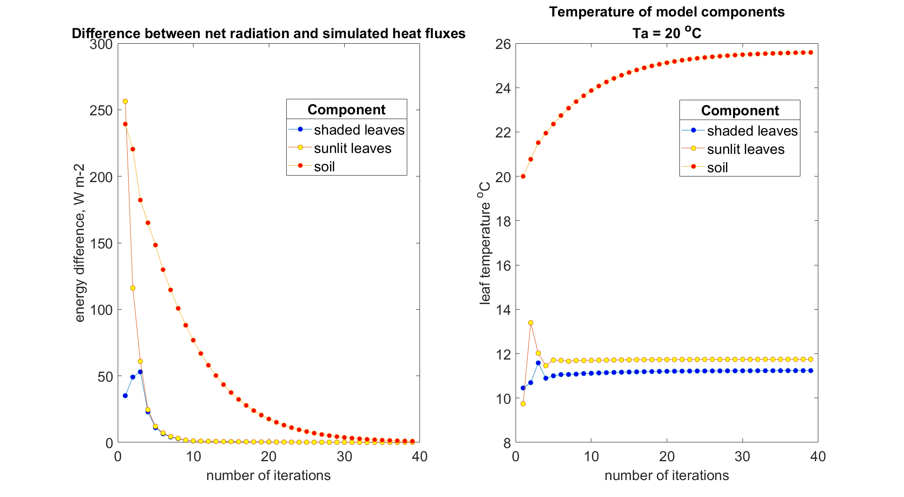

Energy balance
================

``options.calc_ebal``

Definition
'''''''''''''

Net radiation (Rn):

>>> Rn = (SW_in - SW_out) + (LW_in - LW_out)

    | SW - shortwave radiation (400-2400 nm)
    | LW - longwave (thermal) radiation

Net radiation can be partitioned into 3 (4) heat fluxes:

>>> Rn = H + lE + G

    | H - sensible heat
    | lE - latent heat
    | G - ground heat flux

SCOPE
'''''''

With ``options.calc_ebal`` energy balance loop is started until the energy balance is closed (net radiation become equal to heat fluxes).

To close energy balance leaf temperatures and Monin-Obukhov length ``L`` are iteratively adjusted.

This how it looks like:

Leaf temperatures are calculated by :func:`.biochemical` or :func:`.biochemical_MD12`.

Initial values of soil and leaf temperatures are equal to ambient temperature (``Ta``).

Monin-Obukhov length influences on aerodynamic resistances values.

The results of energy balance calculations are the following:

.. list-table::
    :widths: 20 20 20 20 20
    :header-rows: 1
    :stub-columns: 1

    * - variable
      - units
      - canopy
      - soil
      - total
    * - H
      - W m-2
      - 115.5
      - 19.5
      - 135.0
    * - lE
      - W m-2
      - 146.2
      - 44.9
      - 191.1
    * - G
      - W m-2
      - \-
      - 35.0
      - 35.0
    * - Rn
      - W m-2
      - **261.7**
      - **100.1**
      - **361.8**

Also SCOPE calculates photosynthesis of canopy which in this case was 18.7 umol m-2 s-1

Radiation budget is also calculated by SCOPE:

.. list-table::
    :widths: 20 20 20 20 20
    :header-rows: 1
    :stub-columns: 1

    * - variable
      - units
      - in
      - out
      - net
    * - SW
      - W m-2
      - 600
      - 104.4
      - 495.6
    * - LW
      - W m-2
      - 300
      - 434.0
      - -134.0
    * - Rn
      - W m-2
      - \-
      - \-
      - **361.8**
