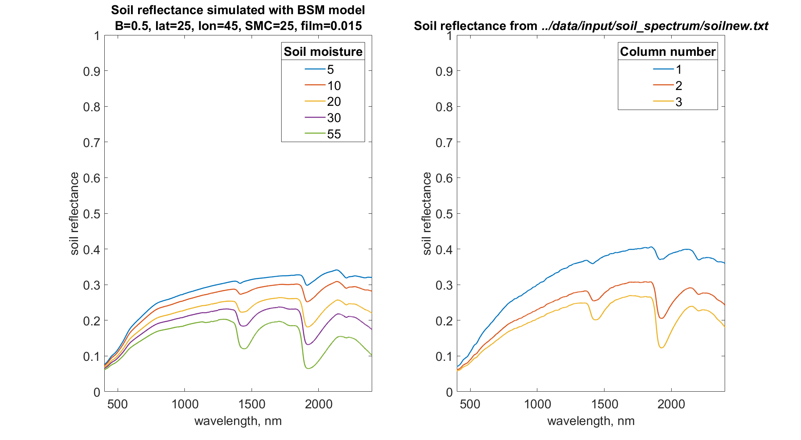
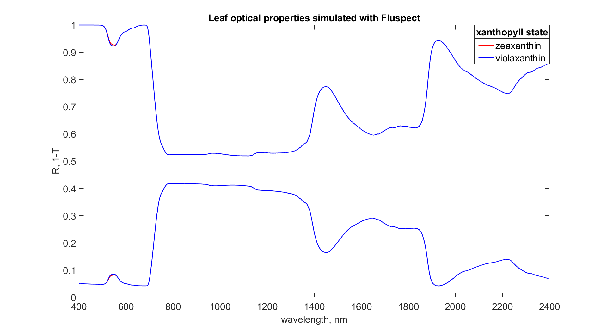
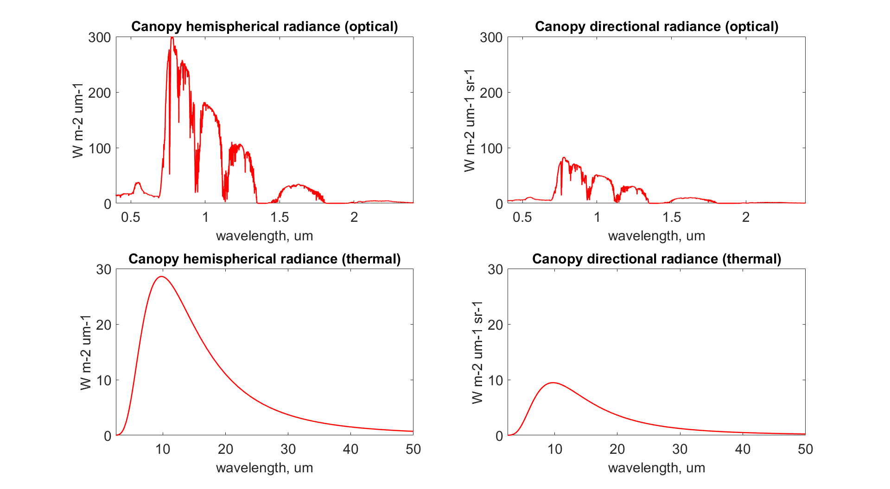

Spectra
========

For thermal part radiance enable ``options.calc_planck`` & ``options.calc_ebal``.

For soil reflectance simulation with BSM model enable ``options.soilspectrum``

Definition
''''''''''''

**Optical** part of spectrum takes into account the ability of objects (leaves, soil) to **reflect** the light.

**Thermal** part of spectrum is based on Planck's law that is any object that has temperature above 0 K **emits** electromagnetic waves.

SCOPE model uses the theory of radiative transfer describing electromagnetic waves propagation and takes into account absorption and scattering.

There are 3 components in the model:

#. soil
#. leaf
#. canopy

SCOPE soil
''''''''''''

SCOPE simulates soil reflectance (optical domain) with :func:`.BSM` (if ``options.soilspectrum``). Alternatively, a file with soil reflectance spectrum might be provided (several options are in ./data/input/soil_spectrum/soilnew.txt*).

On the graph you can see the difference.

SCOPE leaf
''''''''''''

SCOPE model (in particular :func:`.fluspect_B_CX_PSI_PSII_combined`) works similar to PROSPECT model and simulated leaf reflectance, transmittance and absorption (the rest). Bonus part is fluorescence.

The other bonus is xanthopyll cycle, available with ``option.calc_xanthophyllabs``, that you might see as a tiny pick around 500 nm.

.. Note:: We do not have a model for leaf reflectance in the thermal domain.
          Have a suggestion - write to us :ref:`support:support`

SCOPE canopy
'''''''''''''

SCOPE represents canopy as 60 elementary layers of leaves of two types: sunlit (then we account for leaf inclinations) and shaded.

Leaf and soil optical properties are taken into account here.

Optical properties are calculated by :func:`.RTMo` and thermal properties by either :func:`.RTMt_planck` then the output is radiance (as on the graph) or :func:`.RTMt_sb` - only integrated fluxes.

.. Note:: default configuration uses Stefan-Boltzmann's law (:func:`.RTMt_sb`) that will output **spectrally integrated** thermal fluxes instead of per wavelength, in this case:

    - integral of hemispherical thermal radiance is 432.5 W m-2
    - integral of direct radiance 140.4 W m-2
