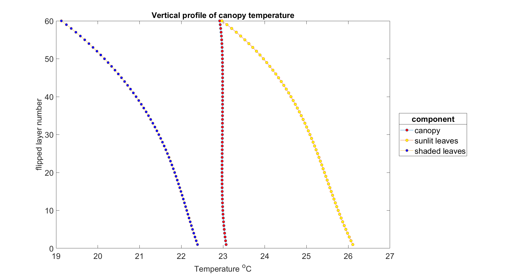

Vertical profiles
===================

``options.calc_vert_profiles`` & ``options.calc_ebal``

Definition
'''''''''''''

We assume, it's not needed.

SCOPE
''''''''

SCOPE represents canopy as 60 elementary layers of leaves of two types: sunlit (then we account for leaf inclinations) and shaded.

Components of energy balance, temperature and fluorescence can be calculated for each layer with ``options.calc_vert_profiles``

.. Warning::
    To produce this graph profiles were flipped so that soil is layer #0 and first canopy layer is layer #1.

    This way top of canopy is actually at the top of the graph (layer #60).
