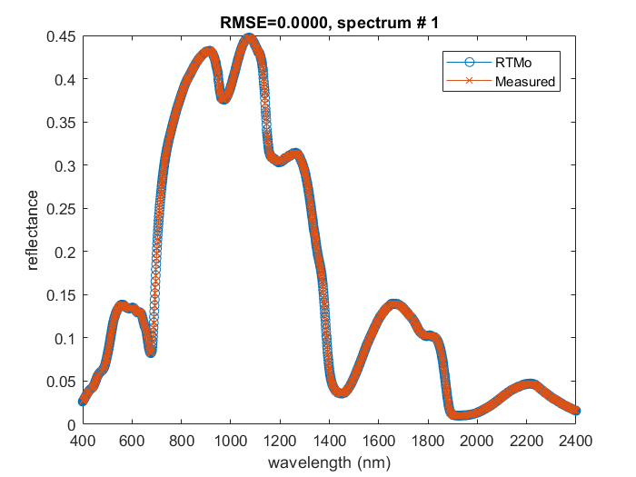
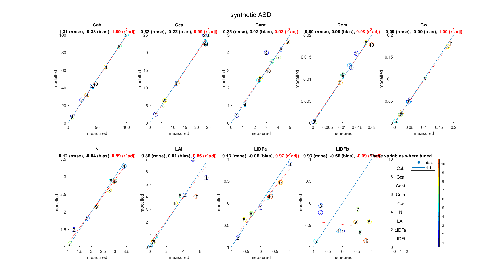
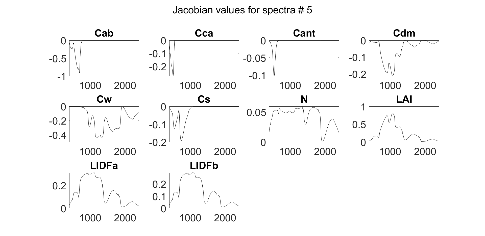

Plots
==========

We provide several plots for the validation of retrieval quality.

Reflectance
-------------

Modelled and measured reflectance curves show if the modelled curve is close enough to the measured curve.

As there might be many spectra we do not show all the figures immediately after the run finishes
but we save them all in the matlab graphical array named ``figures`` with :func:`plot.reflectance_hidden()`
To actually see them set visibility property of the j-th figure to 'on':

.. code-block:: matlab

    set(figures(1), 'Visible', 'on')    % show the plot for the 1st spectrum
    set(figures(5:7), 'Visible', 'on')  % show the plots for the 5, 6, 7 spectra
    set(figures, 'Visible', 'on')       % show the plots for all spectra

If you close the figure (by pressing the upper right red cross) it will also disappear from ``figures`` array;
in fact there will be "handle to the deleted figure".

.. Note::
    You can draw all these plots again from the "%Y-%m-%d_%H%M%S.xlsx" file with :func:`plot.replot_all()`

Validation (1 : 1)
-------------------

To see how well the retrieval worked for your spectra you can provide **validation** on ``Filenames`` tab.

Validation file requirements:
    - first columns - parameter names as they are on ``Input`` tab
    - other columns - measured values of this parameter for each spectra.

Overall the number of columns in **validation** file equals to the number of columns in the **reflectance** file **+1** for parameter names.

Example:

.. list-table::

    * - names
      - spec_1
      - spec_2
      - spec_3

    * - LAI
      - 1.0
      - NA
      - 1.5

    * - Cab
      - 40
      - 30
      - 50

Jacobian
----------

The algorithm of local minimum search :func:`lsqnonlin` uses the gradient descent method
where the next step is driven by the cost-function partial derivative matrix - Jacobian matrix.

For each spectra we calculate the Jacobian matrix at the last step of optimization to propagate standard deviation of reflectance to that of the retrieved parameters.

Jacobian can be plot with :func:`plot.jacobian(J_all, tab, measured.wl, j)` and
its SVD (singular value decomposition) can be plot with :func:`plot.jacobian_svd(J_all, tab, measured.wl, j)` for j-th spectra.

.. Note::
    We do not write the Jacobian matrix to file.
    If you want to analyze it plot it immediately after the model run or save as the .mat file yourself.

.. .. figure:: ../images/svd.png

