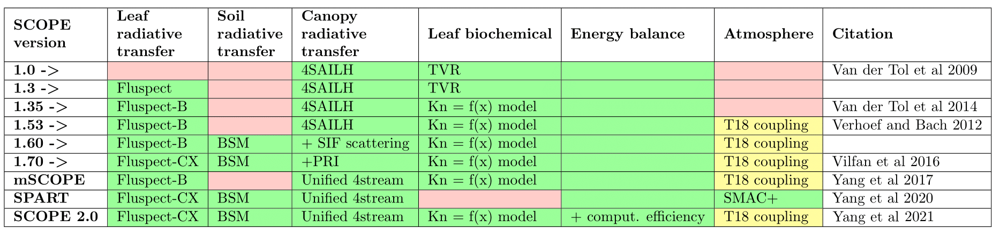

Version history
================



.. contents::

2.1
''''''

2022

Variable name changes:
    * Vcmo -> Vcmax25
    * m -> BallBerrySlope

Default value change:
    * BallBerry0 (intercept) 0.01 [used to be 0.1]

Extra options:
    * write or omit writing spectral output options.save_spectral
    * apply or omit Monin-Obukhov atmospheric stability correction options.MoninObukhov

Performance improvements:
    * soil heat flux (G) derivative is added to soil temperature update loop in ebal.m
    * stomata conductance minimum is 0 umol m-2 s-1 [when Rin=0 & Rdparam=0] ``gs = max(0, 1.6 * A .* ppm2bar ./ (Cs-Ci))``
    * time series run on daily data (without specified time) calculates solar zenith angle (tts) at 12 o'clock
    * more canopy layers at low light ``canopy.nlayers  = ceil(10*canopy.LAI) + ((meteo.Rin < 200) & options.MoninObukhov)*60``

References added to readme

Minor bugfixes


2.00
''''''

2020

detailed description can be found at https://gmd.copernicus.org/preprints/gmd-2020-251/

* Major improvements:
    - much faster computational time (even faster with :ref:`options:``lite```)
    - in-built mSCOPE implementation
    - intuitive code and data organization: :ref:`directories:Directories`
    - .csv input files instead of .xlsx: :ref:`directories/input:input`
    - .csv output files
    - emulator guideline for per-pixel applications (inspired by ARTMO) :ref:`api/lut:+lut`

* minor changes:
    - options:
        - removed: makeplots, rt_thermal, calc_zo (now does it by default), save_headers
        - added: lite, mSCOPE, saveCSV
    - calculation of LST added
    - output files changed


1.74
''''''

2019

* Major changes in ``timeseries`` input:
    - meteorological data can be provided directly from eddy covariance file of berkeley format (FLUXNET standard since 2015) => single .csv (used to be a bunch of .dat files)
    - several years of time series can be run at once => startDOY, endDOY are timestamps (long integers of format YYMMDD[HHMMSS]) (used to be Julian decimal day of year)
    - direct usage of all :ref:`retrieval:Retrieval (Model inversion)` output in timeseries => linear interpolation to meteorological data timestamp (used to be only for Cab and LAI)
    - ``filenames`` tab now has also *column names* instead of file names
    - automatic conversion of units for air pressure (p) (ec - kPa, SCOPE - hPa), soil moisture (SMC) and relative himidity (rH) if needed
    - calculation of atmospherc vapor pressure (ea) from relative humidity and air temperature (Ta) if ea not provided
    - :func:`+io.loadtimeseries` rewritten
* Minor bug fixes in :func:`.RTMt_planck` :func:`.RTMt_sb`
* Functions in +helpers were merged with +equations to reduce confusion between two modules

1.73
''''''

2019

By Ari Kornfeld

* Add "invalid CO2" error check to ebal
	- Invalid complex-valued CO2 values generated by the energy balance routines were incorrectly attributed to fixed_brent (which is the only module that has its own error-checking). This change assigns "blame" closer to the source of the problem.
* Fixes: An intercept termfor the Ball-Berry equation, `BallBerry0`,  was added to the input files ("input_data.xls"x and "input_data.txt") but this value was not read by SCOPE. 
	- Setting `BallBerry0` to 0 disables the iterative solver introduced in v1.7.
* Fix bug because Ccu is not a vector (ebal.m)
	- Add more input-checking to biochemical.m, to catch when initial input is bad.
* pass leafbio.BallBerry0 to biochem_in
	- Delete "null" code (assigning a value to biochem_in.A)
	- Allow active warnings when temperatures include NaN. (should be an error, but doesn't propagate to future time steps, so leave as a warning.
* Add gitignore to skip large, rapdily changing files. And gitattributes
* Increase iter.maxit to 400, so ebal converges.
	- 100 is too few for some realistic cases.
	- Note this does not affect Ball-Berry iteration.
	- Also remove clc, which can be a confusing side-effect.


1.72
''''''

2018

- Bug with soil moisture content (SMC) for :func:`.BSM` is solved.
    - SMC range in input is from **0 to 1** (used in :func:`.calc_rssrbs`, :func:`.Soil_Inertia1`)
    - :func:`.BSM` required SMC in the range from **0 to 100**
    - solution: scaling of SMC within :func:`.BSM`: SMC * 100
    - now :func:`.BSM` accepts SMC from **0 to 1**
    - this bug might effect the results if ``options.soilspectrum == 1``
- Misleading comments in ``filenames`` were corrected
    - SMC is a **one-column** file
    - z-file is a **two-column** table
- ``input_data_default.xlsx`` was added with the verification run parameters to make it easier to check that SCOPE still works after you changed something in the code and do not remember the initial configuration of the ``input_data.xlsx``

1.71
''''''

2018

- **No changes to output or calculations were done.**
- Interactive documentation for ReadTheDocs was created (./docs):
    - ``code`` folder was renamed to ``src`` for autodocumentation
    - all scripts were transformed to functions for autodocumentation
    - functions were grouped into matlab modules (directories starting with ``+`` sign), see :ref:`api:API`
    - **./SCOPE_v1.70/readme** was deleted

1.70
''''''

2017

- OPTIPAR of PROSPECT-D model used, complemented with Xanthophyll spectra for the Violaxanthin to Zeaxanthin conversion.
- The FLUSPECT model includes dynamic Xanthophyll reflectance due to the de-epoxydation state (the ‘PRI effect’) and Athocyanins
- A new radiative transfer model, RTMz, simulates the TOC reflectance as a function of the de-epoxydation state induced by light, water or temperature stress.
- The fluorescence emission spectra have been tuned to FluoWat leaf clip measurements. The option to use the fluorescence spectra of V1.62 and older remains.
- The biochemical routine has been updated, and now the internal CO2 concentration in the leaf is calculated iteratively (Ari Kornfeld)
- The BSM model for soil reflectance added as an option.
- SCOPE and SCOPE_mac_linux merged into a single script.
- The option to load the leaf inclination distribution from a file (besides the option to use the LIDFa and LIDFb parameters to simulate the distribution)
- New outputs: The total emitted fluorescence irradiance by all photosystems (i.e. before reabsorption within the leaf and canopy), the total emitted fluorescence irradiance by all leaves accumulated (i.e. before reabsorption by soil and canopy), and the fluorescence originating from sunlit and shaded leaves and the (multiple) scattered flux have been added as separate output files. The bottom of canopy irradiance flux (the flux on the soil) has been added to the output as a spectrum. Several outputs have been added to the ‘fluxes’ and ‘radiation’ files, including the incident PAR and the incident radiation.
- Two bugs in the RTMt_Planck have been fixed.

1.62
''''''

2016

- Photosynthesis is a function of aPAR absorbed by Chlorophyll (only) rather than total leaf aPAR as in earlier verions.

1.61
''''''

2015

- Bug in the saving of total evaporation data corrected (bug in versions 1.40 to 1.60). Bug in the loading of time series of roughness length for momentum (zo) and zero plane displacement height (d) calculated from LAI and canopy height was corrected.

1.60
''''''

2015

- Major revision of RTMf:  computation speed improved (Ari Kornfeld), scattered fluorescence flux added to the directional flux (Christiaan van der Tol).
- Improved calculation speed of RTMt_sb (AK)
- Revision of Ball-Berry model in biochemical.m:  now iterative calculation of Ci and stomatal conductance (AK)
- Minor improvements in the energy balance (soil heat flux computation, suggested by Georg Wolfahrt).
- Input spreadsheet in ‘SCOPE’ has changed from “input_data.xls” to “input_data.xlsx”. Way of reading the sheets ‘filenames’ and ‘options’ has changed (AK and CvdT). ‘SCOPE’ should now also work for MAC and LINUX, but to be sure, SCOPE_mac_linux.m has been maintained.
- Default value of parameter ‘fqe’ in input spectrum has been tuned to FluoWat measurements

1.54
''''''

2014

- Fluspect replaced by Fluspect_bcar, an updated version of Fluspect with the absorption by carotenoids included, similar to PROSPECT 5


1.53
''''''''

2014

- Correction of a bug in Fluspect, which caused the fluorescence spectra to be 2 × too low in version 1.52.

1.52
''''''''

2013

- Additional fluorescence output, change in the input data of optipar, and some modification of biochemical_MD12.m. Saves also the path of the code (including SCOPE version) to the output. Bug fixed in Fluspect (a scattering coefficient). Correction for PSI fluorescence moved from RTMf to biochemical.m.

1.51
'''''''

2013

- Addition of an alternative leaf level photosynthesis and fluorescence model according to Von Caemmerer (2000) and Magnani et al (2013). Correction of the bug in version 1.40

1.40
''''''''

2014

- Major changes in the structure of the model. Coupling with MODTRAN-derived output files. The irradiance spectral input data are now calculated from MODTRAN atmospheric files. The input is specified in a spreadsheet. Variables are organized in structures which makes it easier to plug in new modules. This version has a bug in the unit of the CO2 concentration.

**Version 1.40 is no longer available.**

1.34
'''''''

2012

- Update of FLUSPECT with separate fluorescence spectra for PSI and PSII. Replacing the TVR09 model for fluorescence with an empirical model. Hemispherically integrated fluorescence is added as an output. The photosynthesis model is made consistent with Collatz et al (1991 and 1992), also used in CLM and SiB models, includes C3 and C4 vegetation, and empirically calibrated fluorescence model according to Lee et al. (2013). The possibility to create Look-Up Tables has been introduced, as well as more options for running only parts of the model.

1.32
''''''''

2012

- The leaf level optical model FLUSPECT was introduced, which produces leaf reflectance, transmittance  and fluorescence spectra. Rather than using given fixed fluorescence matrices as inputs, SCOPE now uses FLUSPECT to calculate the excitation to fluorescence conversion matrices.

1.21
''''''''''

2009

- The SCOPE model as published in Biogeosciences (2009).
